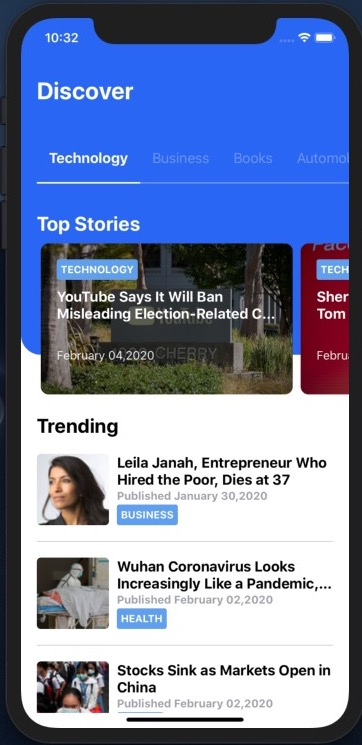

# React Native NYTimes

React Native news app consuming nytimes api.

### Screenshot from iPhone 11

  
  
  

The design is copied and inspired by [TriState Technology](https://dribbble.com/tristate-technology) published in [dribble](https://dribbble.com/shots/6625503-Newsfeed-App-Concept?utm_source=Clipboard_Shot&utm_campaign=tristate-technology&utm_content=Newsfeed%20App%20Concept&utm_medium=Social_Share).
